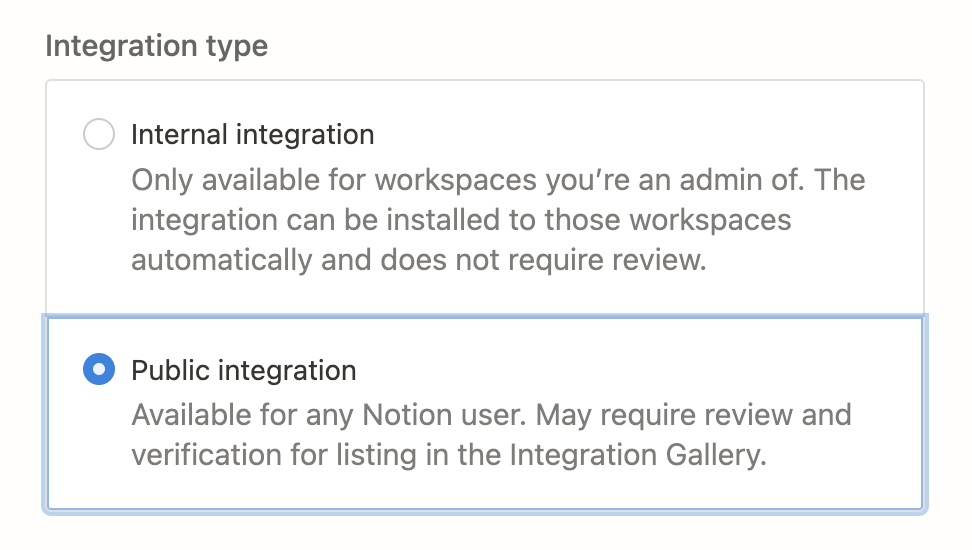

こんにちは、こぷらと申します。
この度、個人開発で「RandoMemory」という Web アプリを公開しましたので紹介させてください。
本記事では以下トピックについて紹介します。

- Firebase + Next.js による簡易アプリ開発方法
- Notion API の活用例
- 個人開発アプリ公開までのステップ

使用した各技術についての詳しい説明やテクニックなどは紹介しませんのであしからず。

これから個人開発を行いたい、他の人がどうやって開発しているのか気になる、そんな人の助けになれば幸いです。

## ToC

- [ToC](#toc)
- [RandoMemory 概要](#randomemory-概要)
  - [開発の動機](#開発の動機)
- [システム構成](#システム構成)
- [Firebase + Next.js で楽に開発する](#firebase--nextjs-で楽に開発する)
  - [お手軽にユーザー認証が実装できる Firebase Authentication](#お手軽にユーザー認証が実装できる-firebase-authentication)
  - [Next.js で複雑な設定をせずに SPA 開発](#nextjs-で複雑な設定をせずに-spa-開発)
  - [Next.js の API Route 機能で API サーバー開発も楽をする](#nextjs-の-api-route-機能で-api-サーバー開発も楽をする)
- [Notion API を活用してドキュメント取得](#notion-api-を活用してドキュメント取得)
  - [Notion API の Authorization](#notion-api-の-authorization)

## RandoMemory 概要

RandoMemory はドキュメント管理ツール [Notion](https://www.notion.so/) に保存されたドキュメントを、ランダムに表示するアプリケーションです。
Notion アカウントで RondoMemory にログインすることで、アカウントの Workspace 内にあるランダムなドキュメントを表示します。

### 開発の動機

どうしてランダム表示? Notion はドキュメントをわかりやすく管理するためのツールじゃないの?
そのように考える人もいるかも知れません。
Notion にメモを書き溜めてそのまんまの人、私以外にもいませんか?
Notion はドキュメントの検索が容易だから、ついついなんでもメモに残してしまいます。
あとで見返そう、なんて思って入るんですが、結局そのまま埋もれてしまうなんてことも。

Notion から情報を探すのではなく、過去の記録を適当に掘り出して思わぬ発見、いわゆるセレンディピティが得られるかも、そんな考えから開発を始めました。

紙の辞書と電子辞書でも似たような論争があったと思います。[^1]

手書きのノートや手帳をパラパラとめくる体験が好きです。
思い出に浸ったり、当時考えてたことからアイデアが生まれたり。
忘れてたことから思わぬ発見、いわゆるセレンディピティが生まれる感覚がすきでした。

最近は何でも電子化してしまい、手書きで記録を残すことも減りました。
非常に便利で手書きの文化に戻る気はしませんが、自分から探しに行かない限り過去の記録にふれる機会も減ってしまいました。
過去のノートをパラパラとめくる、そんな体験ができるアプリは作れないかな、と考えて開発したのが「RandoMemory」です。

## システム構成

- Frontend
  - React(Next.js)
  - MUI
- Backend
  - Firebase
    - Analytics
    - Authentication
    - Firestore
- Hosting
  - Vercel

## Firebase + Next.js で楽に開発する

個人開発は楽してなんぼです。
細かい部分を 0 から開発したい気持ちをぐっとこらえて、優秀なエコシステムに乗っかってサクッと作りましょう。
Firebase + Next.js による開発はそんな考えにピッタリの選択肢です。
あらゆる場所で散々言われつくされてますが、改めてそのメリットを紹介します。

### お手軽にユーザー認証が実装できる Firebase Authentication

個人的に Firebase を使う一番の理由が Firebase Authentication です。
アプリケーションに必須なユーザー認証機能は、自分で作ろうとすると非常に大変です。
ユーザー認証が必要なアプリでは、大体以下のようなフローの作り込みが必要です。

1. ユーザー登録 or ログイン
2. トークンの発行
3. API アクセス前にトークンの検証

Firebase Authentication を利用すれば、 SDK の API を呼ぶだけで上記フローが実現できます。

### Next.js で複雑な設定をせずに SPA 開発

React で SPA を作る際の有力候補は cra(create-react-app) かと思います。
cra を下げるつもりは一切ありませんが、個人開発をするのであれば Next.js のほうが良いかと思っています。
Next.js は SSR/SSG 用のフレームワークですが、 SPA っぽいアプリ開発も問題なくできます。
その上であえて Next.js を使う理由は以下の2つです。

- cra 同様に複雑な設定をイジる必要がない
- cra より簡単に設定の拡張が可能
- 簡易的な API サーバー(後述)が利用可能

### Next.js の API Route 機能で API サーバー開発も楽をする

ユーザー認証が必要になると、オープンには扱えないセキュアな情報も増えてきます。
そのためにバックエンドサーバーを立てるべきですが、できるだけ楽をしたいのが個人開発。
Next.js の [API Route](https://nextjs-ja-translation-docs.vercel.app/docs/api-routes/introduction) 機能を使えば、簡単に API サーバーを立てることができます。

注意点として、Next.js の API Route はあくまで簡易的な API サーバーです。
例えば、同じエンドポイントに対して Get/Post メソッドを使い分ける場合は、API 側できっちり条件分岐を書く必要があります。

```javascript:title=pages/api/user.ts
import type { NextApiRequest, NextApiResponse } from 'next';

export default (req: NextApiRequest, res: NextApiResponse) => {
  if (req.method === "GET"){
    // get process
  } else if (req.method === "POST"){
    // post process
  } else {
    res.status( )
  }
  res.status(200).json({ name: 'John Doe' });
};
```

他にもクエリやボディの扱いやエラーハンドリングなど、使い勝手は専門の Web API フレームワークには劣る印象です。
そのため、開発の立ち上げは Next.js で簡単に API を作り、スケーリングしたら別のフレームワークに移行するのが良いでしょう。

## Notion API を活用してドキュメント取得

Notion API を利用することで workspace 内のドキュメトを取得できます。
細かく説明しませんが、以下のステップでセットアップができます。

1. [インテグレーション管理画面](https://www.notion.so/my-integrations)へアクセス
2. "+ New Integration" をクリック
3. 名前や権限を設定し作成
4. 作成したインテグレーションの Token を利用して API を実行する

インテグレーションとは Notion が外部ツールと連携するための Bot のようなものです。
より詳細なセットアップ方法が知りたい方はドキュメントを確認してください。

<https://developers.notion.com/>

指示に従ってインテグレーションを作ると、最初は Internal (自分のワークスペース専用) なインテグレーションとなります。
今回は Web アプリとして公開するために、Public なインテグレーションを作成しました。
Public インテグレーションでは、OAuth に則って認可したユーザーのワークスペースにもアクセスできるようになります。

### Notion API の Authorization

まずは Public インテグレーションを作成します。

1. [インテグレーション管理画面](https://www.notion.so/my-integrations)へアクセス
2. 作成済みのインテグレーションを選択
3. Integration type を Public に変更
    
4. インテグレーションを利用する Web アプリへの URL などを設定
   1. 開発段階なら localhost で問題なし
5. 設定反映後に表示される ID, secret, URL をメモしておく

[^1]: 紙の辞書は調べる過程で間違ったり、思わぬ発見をしたりするから良い、というあれです。
